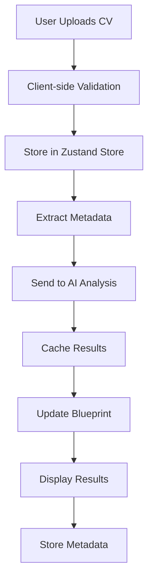
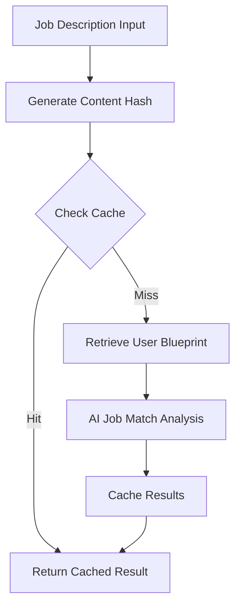
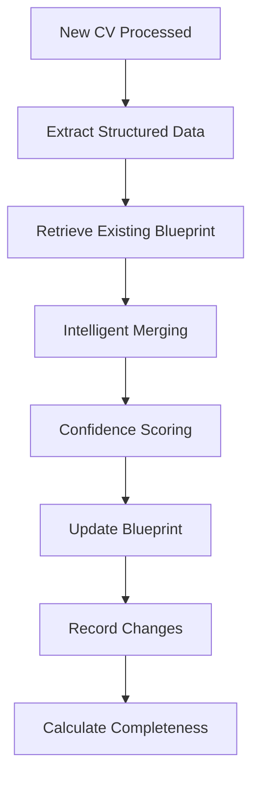

# TechCareer.AI Architecture Overview

## System Architecture

TechCareer.AI is a modern web application built with Next.js, Supabase, and OpenAI, featuring a sophisticated CV analysis and learning system.

```
┌─────────────────┐    ┌─────────────────┐    ┌─────────────────┐
│   Next.js App   │    │   Supabase DB   │    │   OpenAI API    │
│   (Frontend)    │◄──►│   (Backend)     │◄──►│   (AI Models)   │
└─────────────────┘    └─────────────────┘    └─────────────────┘
         │                       │                       │
         ▼                       ▼                       ▼
┌─────────────────┐    ┌─────────────────┐    ┌─────────────────┐
│   Stripe API    │    │   File Storage  │    │   Webhooks      │
│ (Subscriptions) │    │   (Supabase)   │    │   (Real-time)    │
└─────────────────┘    └─────────────────┘    └─────────────────┘
```

## Core Components

### 1. Frontend (Next.js 14)

#### Technology Stack
- **Framework**: Next.js 14 with App Router
- **Language**: TypeScript
- **Styling**: Tailwind CSS + Shadcn/ui components
- **State Management**: Zustand
- **Authentication**: Supabase Auth
- **Deployment**: Vercel

#### Key Features
- **Responsive Design**: Mobile-first approach with adaptive layouts
- **Progressive Enhancement**: Works without JavaScript for core functionality
- **Accessibility**: WCAG 2.1 AA compliance
- **Performance**: Optimized with lazy loading and code splitting

### 2. Backend (Supabase)

#### Database Schema
```
auth.users (Supabase Auth)
├── cv_blueprints (Learning profiles)
├── cv_blueprint_changes (Audit trail)
├── cv_metadata (CV extractions)
├── job_match_analyses (Cached results)
├── job_positions (Application tracking)
├── subscriptions (Stripe billing)
└── tailored_cvs (Custom CV versions)
```

#### Row Level Security (RLS)
- Users can only access their own data
- Service role bypasses for admin operations
- Policies enforced at database level

### 3. AI Integration (OpenAI)

#### Models Used
- **GPT-4o**: Primary model for CV analysis and job matching
- **GPT-4o-mini**: Fallback model for cost optimization
- **Custom Prompts**: Domain-specific prompting for consistent results

#### Rate Limiting
- API-level rate limiting (100 req/min per user)
- Cost monitoring and budget alerts
- Automatic fallback to cached results

## Data Flow Architecture

### CV Upload & Analysis Flow



### Job Matching Flow



### Blueprint Learning Flow



## Key Architectural Patterns

### 1. CQRS (Command Query Responsibility Segregation)

#### Commands (Write Operations)
- `analyze-cv`: Process CV and update blueprint
- `evaluate-job-match`: Analyze compatibility and cache
- `update-cv-metadata`: Modify stored metadata

#### Queries (Read Operations)
- `get-cv-blueprint`: Retrieve learning profile
- `get-cv-metadata`: List user metadata
- `get-job-positions`: Application tracking data

### 2. Event Sourcing (Blueprint Changes)

```typescript
interface BlueprintChange {
  id: string;
  user_id: string;
  blueprint_id: string;
  change_type: 'skill_added' | 'experience_updated' | 'confidence_changed';
  field: string;
  old_value?: any;
  new_value?: any;
  confidence_impact: number;
  created_at: Date;
}
```

### 3. Repository Pattern

```typescript
// Data access layer abstraction
class CVBlueprintRepository {
  async getByUserId(userId: string): Promise<CVBlueprint | null>
  async create(userId: string): Promise<CVBlueprint>
  async update(blueprint: CVBlueprint): Promise<void>
  async recordChange(change: BlueprintChange): Promise<void>
}
```

## Blueprint Learning System

### Core Algorithm

1. **CV Ingestion**: Parse and structure raw CV data
2. **Deduplication**: Identify and merge duplicate information
3. **Confidence Scoring**: Weight information based on recency and frequency
4. **Gap Analysis**: Identify missing profile sections
5. **Evolution Tracking**: Monitor profile improvements over time

### Merging Strategy

```typescript
interface MergeStrategy {
  skills: 'union' | 'intersection' | 'confidence_based';
  experience: 'chronological' | 'relevance_based';
  education: 'latest' | 'comprehensive';
  contact: 'most_recent' | 'validated';
}
```

### Confidence Scoring

```typescript
interface ConfidenceScore {
  source_count: number;      // How many CVs mention this
  recency_weight: number;    // Recent data gets higher weight
  consistency_score: number; // Consistent across sources
  validation_score: number;  // External validation (LinkedIn, etc.)
}
```

## Caching Strategy

### Multi-Level Caching

1. **Database Cache**: Supabase tables for persistent storage
2. **Memory Cache**: Redis (future enhancement)
3. **CDN Cache**: Static assets and API responses
4. **Browser Cache**: Zustand store for client-side state

### Cache Keys

```typescript
// CV Analysis Cache
cv_analysis:{user_id}:{cv_hash}

// Job Match Cache
job_match:{user_id}:{cv_hash}:{job_hash}

// Blueprint Cache
blueprint:{user_id}
```

### Cache Invalidation

- **Time-based**: 24 hours for analysis results
- **Event-based**: Blueprint updates invalidate related caches
- **Manual**: User-triggered cache clearing

## Security Architecture

### Authentication & Authorization

```typescript
// Supabase Auth integration
const authMiddleware = (handler) => async (req, res) => {
  const { data: { user }, error } = await supabase.auth.getUser()

  if (error || !user) {
    return res.status(401).json({ error: 'Unauthorized' })
  }

  return handler(req, { user, supabase })
}
```

### API Security

- **JWT Tokens**: Supabase-managed authentication
- **CORS**: Configured for allowed origins
- **Rate Limiting**: Redis-based request throttling
- **Input Validation**: Zod schemas for all inputs
- **SQL Injection Prevention**: Parameterized queries

### Data Privacy

- **Encryption**: AES-256 for sensitive data
- **PII Handling**: Minimal data retention policies
- **GDPR Compliance**: Data export and deletion capabilities
- **Audit Logging**: All data access logged

## Performance Optimizations

### Database Optimizations

```sql
-- Optimized indexes
CREATE INDEX idx_cv_blueprints_user_id ON cv_blueprints(user_id);
CREATE INDEX idx_job_match_cache ON job_match_analyses(user_id, cv_hash, job_hash);
CREATE INDEX idx_cv_metadata_user ON cv_metadata(user_id, created_at DESC);
```

### Query Optimization

- **Pagination**: Cursor-based pagination for large datasets
- **Selective Loading**: Only load required data
- **Batch Operations**: Bulk updates for efficiency
- **Connection Pooling**: Supabase handles connection management

### Frontend Optimizations

- **Code Splitting**: Route-based splitting
- **Image Optimization**: Next.js automatic optimization
- **Bundle Analysis**: Webpack bundle analyzer integration
- **Service Workers**: Offline capability for core features

## Scalability Considerations

### Horizontal Scaling

1. **Stateless API**: All services can be horizontally scaled
2. **Database Sharding**: Future user-based sharding
3. **CDN Integration**: Global content delivery
4. **Microservices**: Potential service decomposition

### Monitoring & Observability

```typescript
// Application monitoring
const monitoring = {
  performance: 'Next.js Analytics',
  errors: 'Sentry',
  business: 'Mixpanel',
  infrastructure: 'Supabase Dashboard'
}
```

### Backup & Recovery

- **Database Backups**: Supabase automated daily backups
- **Point-in-time Recovery**: 7-day retention
- **Data Export**: User data export capabilities
- **Disaster Recovery**: Multi-region replication

## Deployment Architecture

### Development Environment

```bash
# Local development
npm run dev          # Next.js dev server
supabase start       # Local Supabase instance
ngrok http 3000      # Webhook tunneling
```

### Production Environment

```yaml
# Vercel deployment
framework: nextjs
buildCommand: npm run build
installCommand: npm install
env:
  - SUPABASE_URL
  - SUPABASE_ANON_KEY
  - OPENAI_API_KEY
  - STRIPE_SECRET_KEY
```

### CI/CD Pipeline

```yaml
# GitHub Actions workflow
name: Deploy to Production
on:
  push:
    branches: [main]
jobs:
  test:
    runs-on: ubuntu-latest
    steps:
      - uses: actions/checkout@v3
      - uses: actions/setup-node@v3
      - run: npm ci
      - run: npm test
      - run: npm run build
```

## Future Enhancements

### Planned Features

1. **Advanced AI Models**: Integration with Claude, Gemini
2. **Real-time Collaboration**: Team CV review features
3. **Mobile App**: React Native companion app
4. **Integration APIs**: LinkedIn, Indeed, Glassdoor
5. **Advanced Analytics**: Career trajectory predictions

### Technical Debt & Improvements

1. **Database Migration**: Move to PostgreSQL 15+
2. **Caching Layer**: Implement Redis for performance
3. **Monitoring**: Add comprehensive observability
4. **Testing**: Increase test coverage to 90%+
5. **Documentation**: Auto-generated API docs

## Conclusion

TechCareer.AI represents a modern, scalable architecture that leverages cutting-edge technologies to provide intelligent career guidance. The blueprint learning system creates a unique competitive advantage by continuously improving analysis quality over time.

The architecture prioritizes:
- **Scalability**: Horizontal scaling capabilities
- **Security**: Multi-layer security approach
- **Performance**: Optimized for speed and efficiency
- **Maintainability**: Clean code and comprehensive testing
- **User Experience**: Fast, responsive, and accessible

This foundation supports rapid feature development while maintaining system reliability and performance.
